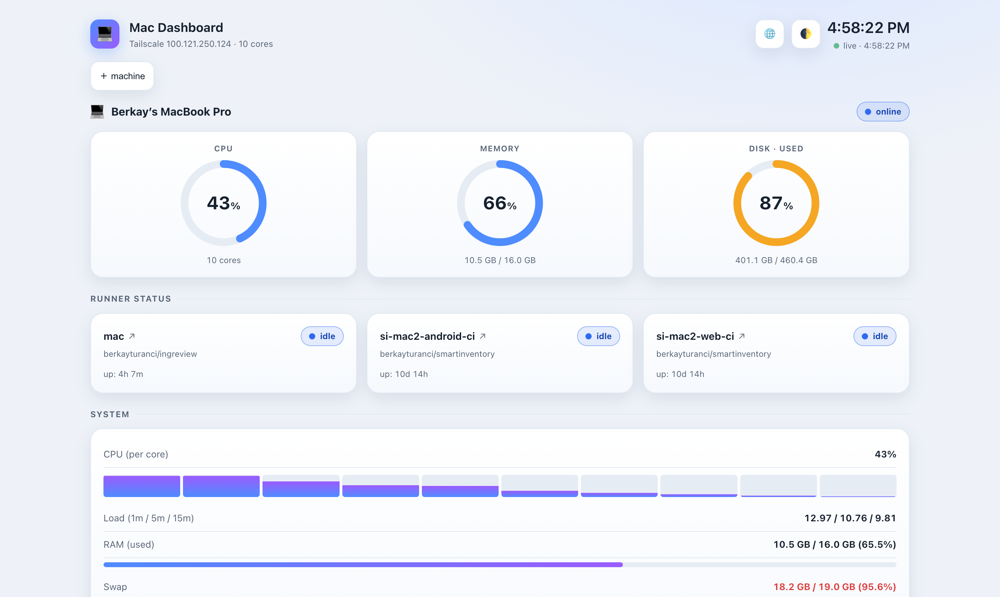
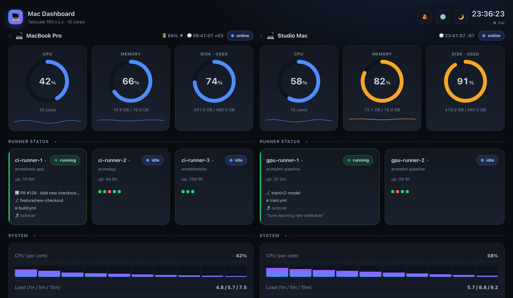

# mac-sysdash


A tiny, dependency-light **system + GitHub Actions runner dashboard** for macOS,
reachable over your LAN or [Tailscale](https://tailscale.com/) from any device.

<p align="center">
  
</p>

It is a single Python file (stdlib HTTP server) plus one HTML file. The only
third-party dependency is [`psutil`](https://github.com/giampaolo/psutil) — and
the installer sets that up for you in an isolated virtualenv.

## Features

- **CPU / Memory / Disk** ring gauges (blue → amber → red), refreshing every second.
  - On macOS, **disk** usage is read from the APFS data volume and reported as
    `total − free`, and **memory** as `total − available`, so the percentages
    match Finder's Storage and Activity Monitor instead of under-counting.
  - **Disk-fill ETA** — when the disk is trending up, the disk gauge shows the
    estimated time-to-full (`⏳~6d`) from the least-squares slope of the last 24h.
- **Fleet Overview Banner** — a sticky top bar aggregating the total online machines and the fleet-wide count of busy, idle, and offline runners.
- **Active runs** — currently-busy runners across every machine grouped by their
  run (PR / branch + workflow), so one run split across runners/Macs shows as a
  single entry with per-runner job chips.
- **High-usage alerts**: a red badge on the gauge, a top banner, and a `⚠️`
  prefix in the browser tab title so you notice even from another tab. The
  **thresholds are configurable** in a ⚙ settings popover (critical %, warning %,
  stuck-job minutes), plus **CI failure alerts** when a runner job finishes
  `Failed`.
- **Thermal pressure badge** — a `🌡` chip appears on a machine's header when the
  SoC throttles (`pmset -g therm`), the build slowdown CPU% can't show.
- **GitHub Actions self-hosted runners**, auto-discovered, with a live status pill
  (`busy` / `idle` / `offline`):
  - For a **busy** runner, the card shows what it is working on — the **job**
    (e.g. `Build Android APKs`), **branch**, **workflow**, **PR / issue**,
    **commit**, and the triggering **actor** — read locally (no GitHub token).
    A workflow can split its jobs across several runners, so the job name is what
    tells each runner's work apart (the same run otherwise looks identical on all
    of them).
  - A row of **recent-job dots** (green = succeeded, red = failed) per runner.
  - A **30-day CI health heatmap** per runner in the detail modal, coloured by
    outcome (green = all ok, amber = some fails, red = all fails, muted = none).
  - **Click a runner for a detail modal** — showing the current job, aggregate job statistics (runs, success rate, median duration, trends), a **Gantt chart Timeline** of the last 50 jobs, and recent job details; each row links to that workflow's runs on GitHub.
  - **Flaky job detection** — jobs that both pass and fail over the last 14 days
    (10–90 % fail rate) are listed in the modal with their fail rate.
  - **Queue pressure** — on serial self-hosted runners, jobs that started right
    after the previous one were queued waiting; the modal shows a pressure bar
    (% queued + estimated wait), a fleet-sizing signal the busy/idle view can't give.
  - **Persistent history:** A background SQLite thread continually stores finished jobs from local logs, ensuring history survives restarts and spans weeks.
- **Scheduled (dead-man) checks** — cron jobs ping `/api/ping` on success; a
  "Scheduled checks" strip flags any that go silent (up → late → down) and raises
  an alert. Fully self-contained, no external service. See below.
- **Self-update badge** — a header badge shows how many commits this checkout is
  behind `origin/main` (hourly background `git fetch`).
- **Multiple machines side by side**, filling the width and wrapping down. One
  machine is the hub; peers are gathered by the hub (pull) or pushed by nodes that
  can't accept inbound — the browser only talks to the hub, so it works on a phone
  too. **Drag a panel by its header to reorder.**
- **Collapsible sections** — fold Runner status / System / Top processes to keep just
  the CPU / memory / disk gauges in view.
- **System detail** — per-core CPU bars, load average (with trend sparkline),
  RAM/swap/disk, **network throughput** (with per-interface breakdown — en0 vs
  Tailscale `utun` — and a daily ↓/↑ total), **disk I/O** read/write sparklines,
  battery, uptime, and the **top memory or CPU** consuming processes — with an
  **Apps** view that rolls a multi-process app's children into one line
  (`Google Chrome ×41 · 2.2 GB`).
- **Baseline anomaly cue** — each gauge shows a subtle `↑ unusual` hint when a
  metric is more than 2σ from its own last-24h average, catching "abnormal for
  now" that fixed thresholds miss.
- **AI Copilot usage** — per-provider session/weekly usage (and reset countdowns),
  read locally from CodexBar's files (no token, no API).
- **Trends** — a 60-second sparkline under each gauge (CPU / memory / disk);
  **click a gauge** for a larger ~5-minute time-series chart with a **hover
  crosshair** (value + time at the cursor).
- **Runner filter** — show **all** runners or only the **active** (busy) ones.
- **Notifications** — desktop/phone alerts when a metric goes critical (browser
  notifications need HTTPS), plus two off-browser channels so alerts reach you
  with the tab closed: a **webhook** (ntfy.sh / Slack / Discord, set in ⚙) and a
  **native macOS notification** for server-fired dead-man check alerts.
- **TV / wall mode** — a `📺` toggle (or `?tv`) hides the chrome and scales the
  layout up for an always-on display.
- **Per-machine local time** (with timezone) — handy across timezones.
- **Installable (PWA)** — "Add to Home Screen" on iOS/Android for an app-like,
  full-screen view from your phone.
- **Light / dark / night / auto theme** following the system appearance, with a
  toggle. **Night** is a dimmed, desaturated, motion-free mode for working late.
- **English / Turkish UI** — defaults to the system language, with an
  auto / EN / TR selector.
- **Light on resources** — ~20 MB RAM, ≈0 % CPU. Runs at login and self-restarts
  via a per-user `launchd` agent.

## Screenshots

Light (above) and dark themes, two machines side by side:

<p align="center"></p>

## Requirements

- macOS (tested on Apple Silicon)
- `python3` (the Xcode Command Line Tools provide one: `xcode-select --install`)

`psutil` is installed automatically into a virtualenv by `install.sh`; nothing
else is required.

## Install

```sh
git clone https://github.com/berkayturanci/mac-sysdash.git
cd mac-sysdash
./install.sh
```

The installer runs the app **in place from this repo clone** (no copy), ensures
`psutil` (using an existing interpreter that has it, otherwise a fresh venv under
`venv/`), generates a per-user `launchd` agent, and starts it. The dashboard then
runs at login, restarts on crash, and listens on all interfaces:

```
http://localhost:8765
http://<your-tailscale-ip>:8765   # from another device on your tailnet
```

Change the port with `SYSDASH_PORT=8770 ./install.sh`.

## Updating

```sh
git pull && ./install.sh
```

The page (`index.html`) is read live on each request, so a `git pull` updates the
UI immediately; re-running `install.sh` restarts the agent to pick up `server.py`
changes.

## Uninstall

```sh
./uninstall.sh
```

## Multiple machines

Run mac-sysdash on each machine; one machine acts as the **hub** you open in the
browser. Peers are gathered two ways, and the browser only ever talks to the hub
(so it works the same on a phone over HTTPS — no per-peer setup, no mixed content):

1. **Pull (default).** The hub discovers online Tailscale peers, fetches each
   peer's `/api/stats` server-side, and exposes them via its `/api/peer` proxy.
   Works whenever the hub can reach the peer.

2. **Push (opt-in).** A machine that **can't accept inbound connections** (strict
   NAT/firewall, locked-down host, no `tailscale serve`) instead POSTs its own
   stats to the hub. Enable it by pointing `SYSDASH_PUSH_TO` at the hub's push URL:

   ```sh
   SYSDASH_PUSH_TO=https://<hub-host>.<tailnet>.ts.net/api/push ./install.sh
   ```

   The node then streams its stats outbound every few seconds and shows up on the
   hub like any other machine. Pull and push coexist; push is off unless set. A
   peer that stops pushing is shown as **stale** (amber, with "Ns ago") before it
   drops off.

> **Security.** The dashboard has no authentication and `/api/push` accepts any
> POST. It is meant for a private tailnet — keep it tailnet-only (don't expose it
> publicly with Tailscale **Funnel**). The `/api/peer` proxy only fetches IPs that
> are already your tailnet peers.

## Runner auto-discovery

Runners are discovered two ways, with no code changes when you add one:

1. **Filesystem** — directories under the roots in `RUNNER_ROOTS` (`server.py`)
   that contain a runner's `.runner` config file. Default: `~/GitHub`.
   > Keep these roots out of TCC-protected folders (`~/Documents`, `~/Desktop`,
   > `~/Downloads`, iCloud/CloudStorage). A `launchd` background agent without
   > Full Disk Access can block indefinitely when touching them.
2. **Running processes** — any live `Runner.Listener` / `Runner.Worker` process,
   wherever it is installed.

Status: a `Runner.Worker` means **busy**, a `Runner.Listener` alone means
**idle**, neither means **offline**.

The displayed runner name comes from each runner's own `.runner` config
(`agentName`), so renaming a runner is reflected here automatically.

## Runner naming (recommended)

The dashboard reads each runner's registered name, so a consistent scheme makes
a multi-machine fleet readable at a glance:

- **Name = `<machine>-<role>`** — a stable per-machine token plus its purpose
  (e.g. `mbp-ingreview`, `ekos-web-ci`). Names are unique per repo and exist for
  humans to tell machines apart, so avoid generic tokens like `mac` when you run
  more than one Mac.
- **Labels do the routing, not the name.** Workflows target
  `runs-on: [self-hosted, macOS, ARM64, <custom>]`; the default labels plus any
  capability labels (`android`, `web`, …) decide which runner picks up a job, so
  you can rename a runner without breaking any workflow.
- Lowercase, hyphen-separated; keep the same machine token across every repo a
  machine serves.

To rename an existing runner, re-register it (no workflow changes needed):

```sh
cd <runner-dir>
TOKEN=$(gh api -X POST repos/<owner>/<repo>/actions/runners/registration-token --jq .token)
./svc.sh stop && ./svc.sh uninstall
./config.sh remove --token "$(gh api -X POST repos/<owner>/<repo>/actions/runners/remove-token --jq .token)"
./config.sh --url https://github.com/<owner>/<repo> --token "$TOKEN" --name <new-name> --unattended --replace
./svc.sh install && ./svc.sh start
```

## HTTPS & notifications (optional)

The bell in the header can push a desktop/phone notification when a machine goes
critical — but browsers only allow notifications in a **secure context**. Expose
mac-sysdash over HTTPS on your tailnet with [Tailscale Serve](https://tailscale.com/kb/1242/tailscale-serve):

```sh
./serve.sh
```

This prints a clean `https://<host>.<tailnet>.ts.net` URL (no port). Open it,
click the bell to grant permission, and you'll get alerts even from your phone.
Stop sharing with `tailscale serve reset`. (Requires HTTPS enabled for your
tailnet in the Tailscale admin console.)

> **Multiple machines over HTTPS:** a browser on an HTTPS page can't fetch
> `http://<peer>:8765` (mixed content), so run `./serve.sh` on *each* machine you
> want to see. The dashboard then auto-discovers peers at their HTTPS Tailscale
> name. Over plain `http://…:8765` on a LAN this isn't needed.

## Scheduled (dead-man) checks

Monitor cron jobs, backups, and scheduled scripts without any external service:
have each job ping sysdash on **success**. If a job goes silent past its expected
period (plus a grace window), the dashboard marks it `late` then `down`, shows it
in the "Scheduled checks" strip, and raises an alert (banner + notification, and
a native macOS notification).

```sh
# at the end of your cron job / script, on success:
… && curl -fsS "http://localhost:8765/api/ping?job=nightly-backup&period=86400&grace=3600"
```

`period` and `grace` are seconds and only need to be sent once (they're
remembered); later pings can be just `?job=nightly-backup`. State is stored in the
local SQLite DB, so checks survive restarts.

## Tests

A `unittest` suite (no third-party deps beyond `psutil`) covers the server:
config/event/log parsing (including runner history: result, workflow, job,
PR/branch, actor, PR head, and the live job name), the disk/memory invariants,
tailnet peer discovery, push/proxy endpoints, battery, the HTTP routes, and the
SQLite-backed history/flaky/queue/dead-man-check/daily-bandwidth logic. The
browser UI (themes, filters, charts) isn't unit-tested. Run it with any Python
that has `psutil`:

```sh
python3 -m unittest discover -s tests -v
# or, if the installer created one:
./venv/bin/python -m unittest discover -s tests -v
```

## Configuration

Environment variables (set them before `./install.sh`; they are written into the
launchd agent):

- `SYSDASH_PORT` — listening port (default `8765`)
- `SYSDASH_PUSH_TO` — a hub's `/api/push` URL; when set, this node streams its
  stats to that hub (for machines that can't accept inbound). Off by default.

At the top of `server.py`:

- `RUNNER_ROOTS` — where to scan for runner installs
- `VERSION` — shown in the page footer

In the UI (⚙ settings popover, stored per-browser in `localStorage`): alert
thresholds (critical %, warning %, stuck-job minutes) and the alert **webhook URL**.

## How it works

- A background thread samples CPU once per second so HTTP requests never block.
- `/api/stats` returns a JSON snapshot; the page polls it every second.
- The snapshot is cached for ~0.8 s behind a lock, so many concurrent viewers
  share one computation instead of each spawning a process scan.
- A busy runner's run context (PR, branch, commit, actor) comes from
  `<runner>/_work/_temp/_github_workflow/event.json` — the webhook payload the
  runner already writes locally. That payload is the *workflow trigger*, shared by
  every job in a run, so the **job name** is read separately from the newest
  `<runner>/_diag/Worker_*.log` (one Worker log per job).
- A background thread (`_jobs_sampler`) periodically parses those Worker logs to 
  extract execution time, status, and job parameters, committing them to a local
  `sqlite3` database to serve the Heatmap and Timeline views without any external DB.
- Peers are exposed via `/api/peers` (list) and `/api/peer?key=…` (one peer's
  stats), both served from the hub so the browser never makes cross-origin calls.
  The hub fills these by pulling reachable peers and by accepting pushes on
  `/api/push`.

## Troubleshooting

- **A peer shows "offline" / unreachable.** Confirm sysdash is running there
  (`curl -s localhost:8765/api/stats` returns JSON) and that the address
  includes a reachable host. If it answers locally but not over Tailscale, the
  macOS firewall is likely dropping incoming connections — allow the interpreter
  in System Settings → Network → Firewall, or turn the firewall off.
- **AI widget missing a provider (e.g. Antigravity).** Claude/Codex are read
  from CodexBar's history files and need no extra permission. Antigravity lives
  only in CodexBar's Group Container, which macOS hides from the `launchd` agent
  (TCC). The AI widget shows the **exact binary path** to authorize — add it
  under System Settings → Privacy & Security → **Full Disk Access** (click "+",
  then ⇧⌘G to paste the path). It appears as a generic **"Python"** entry; the
  path shown in the widget is the one to pick.
- **Port already in use.** Reinstall on another port: `SYSDASH_PORT=8770 ./install.sh`.
- **Logs.** `~/.local/log/sysdash.log`.

## License

MIT — see [LICENSE](LICENSE).
